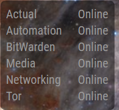
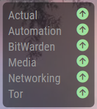

# MMM-uptimekuma [](https://github.com/MikeBishop/MMM-uptimekuma/raw/master/LICENSE) 

MagicMirror² module to get uptime data from an [Uptime
Kuma](https://github.com/louislam/uptime-kuma) status page.

## Examples
 <br>
 


## Installation
1. Clone this repository in your MagicMirror installation under modules.
2. Run `npm install` in the module directory.
3. Add configuration to config.js

## Using the module

To use this module, add the following configuration block to the modules array in the `config/config.js` file:
```js
var config = {
    modules: [
        {
            module: 'MMM-uptimekuma',
            config: {
                // See below for configurable options
            }
        }
    ]
}
```
## Requirements

Uptime-Kuma must be accessible. Because authentication is required to read
anything except status pages, this module reflects a given status page. **You
must create a status page before this module can read it.**

The default status page is named `default`, and will be used if no slug is given
in the config, but even the default status page does not exist until you create
it.

## Configuration options

| Option           | Description
|----------------- |-----------
| `useIcons`       | Flag to use icons (`true`) or text (`false`) values for status of monitor.<br>Default: `false` - text values.
| `useColors`      | Flag to use colors (`true`) for status of monitor<br>Default: `false` - without colors.
| `baseUrl`        | Base URL of Uptime Kuma install <br>Default: "http://localhost:3001"
| `statusPage`     | Slug of UptimeKuma status page to display <br>Default: "default"
| `headers`        | Display the name of each group from the status page? Values are `true`, `false` or `"auto"`. (Auto is equivalent to `true` if there are multiple groups, but `false` for a single group.)<br>Default: `"auto"`
| `vertical`       | If multiple groups are defined, should they be laid out vertically (`true`) or horizontally (`false`)?<br>Default: `true`
| `updateInterval` | Time (in ms) between updates. Note that Uptime Kuma caches status pages for 5 minutes, so updates may take up to 5 minutes to propagate even with a smaller setting.<br>Default: 60000
